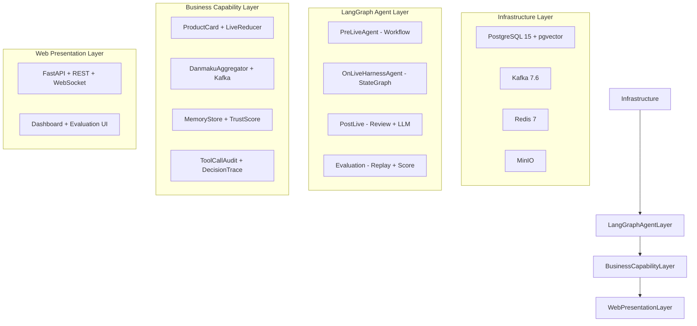

# LiveAgent

> 淘宝主播 AI 助手 -- 基于 LangGraph 的直播 Agent 系统

## 架构总览



## 前置要求

- Docker 25+ - 运行 PostgreSQL + Kafka + Zookeeper + MinIO
- Python 3.12+ - 运行 Agent 和 API 服务
- (可选) DeepSeek API Key - LLM 播后复盘需要

## 快速开始

```bash
git clone <repo-url>
cd live-agent
pip install -r requirements.txt
docker compose up -d
python scripts/run_all.py up
open http://localhost:8100
```

Windows: .\
un.ps1 docker -> .\
un.ps1 up
无 Docker: python scripts/run_all.py demo

## 演示场景

| 场景 | 触发 | 展示 |
|------|------|------|
| 播前手卡 | 打开Web副屏 | 商品话术建议 |
| 播中Agent | 弹幕入Kafka | 观察->决策->工具 |
| 人审 | 高风险工具 | pending->批准/拒绝->恢复 |
| 弹幕 | Kafka consumer | 5秒窗口写DB |
| 播后复盘 | 直播结束 | 归因指标+LLM总结 |
| Agent评估 | CLI或API | 回放+7维评分 |

## 核心功能

| 阶段 | 能力 | 实现 |
|------|------|------|
| 播前 | Workflow手卡 | LangGraph + RulesPlanner |
| 播中 | Agent决策 | Harness Agent + Interrupt/Resume |
| 播中 | 弹幕捕获 | Kafka consumer + 5秒聚合 |
| 播中 | Web人审 | FastAPI + Vanilla JS |
| 播后 | 规则复盘 | PostLiveReview + Attribution |
| 播后 | LLM总结 | DeepSeek降级模板 |
| 评估 | Agent回放 | LangGraph get_state_history |
| 评估 | 规则评分 | AgentRuleEvaluator 7维度 |
| 评估 | LLM Judge | AgentLLMJudge partial |
| 运维 | 操作员鉴权 | Header token校验 |
| 运维 | 审批锁+TTL | 行级锁+10分钟过期 |
| 运维 | 幂等审批 | Idempotency Key |
| 运维 | Worker恢复告警 | lease过期+3次重试fail |

## API一览

| 端点 | 方法 | 作用 | 鉴权 |
|------|------|------|------|
| /api/card/{id} | GET | 商品手卡 | 无 |
| /api/danmaku/summary | GET | 弹幕摘要 | 无 |
| /api/alert/{room_id} | GET | 库存告警 | 无 |
| /api/review/{room_id} | GET | 播后复盘 | 无 |
| /api/agent/harness/start | POST | 启动Harness | 无 |
| /api/agent/harness/status | GET | 审批状态 | 无 |
| /api/agent/harness/approval | POST | 提交审批 | operator |
| /api/agent/evaluations | POST | 创建评估 | 无 |
| /api/agent/evaluations/{id} | GET | 评估结果 | 无 |
| /api/agent/evaluations/{id}/reviews | POST | 复核 | reviewer |
| /api/agent/replays/{trace_id} | GET | 回放 | 无 |
| /ws | WS | 实时推送 | 无 |
| /evaluation | GET | 运维页面 | 无 |

## 项目结构

```text
live-agent/
  src/core/      LangGraph Agent编排
  src/gateway/   API服务 持久化Store WebSocket
  src/skills/    业务能力: 手卡 弹幕 LLM
  src/config/    配置中心 Pydantic Settings
  front/         Web副屏
  scripts/       演示脚本
  docker/        数据库init SQL
  tests/         单元+集成测试
```

## 技术栈

LangGraph / FastAPI / PostgreSQL 15 / Kafka 7.6 / DeepSeek / pgvector / Redis / MinIO

## 测试

```bash
pytest tests/unit/ -v
python scripts/check_doc_encoding.py
```

## 开发说明

- 新增Agent: src/core/下定义StateGraph
- 新增工具: agent_tool_executor.py注册
- 数据库变更: docker/下init SQL + 迁移脚本
- 编码: UTF-8 中文注释解释业务规则

## License

MIT